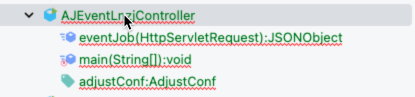
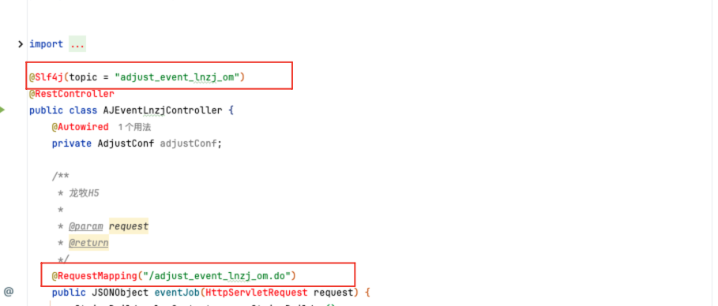

1. 代码新建一个类


2. 代码修改 log 的topic 以及 访问前缀


3. resources logback-spring.xml 添加 topic
```xml
    <!--龙女指尖-adjust逗号分隔测试-->
    <appender name="file—adjust_event_lnzj_tw" class="ch.qos.logback.core.rolling.RollingFileAppender">
        <encoder>
            <pattern>${log.pattern}</pattern>
            <charset>UTF-8</charset>
        </encoder>
        <!--滚动策略按照天-->
        <rollingPolicy class="ch.qos.logback.core.rolling.TimeBasedRollingPolicy">
            <!--路径-->
            <fileNamePattern>
                ${log.basePath}/adjust_event_lnzj_tw/adjust_event_lnzj_tw.%d.log
            </fileNamePattern>
        </rollingPolicy>
    </appender>

    <logger name="adjust_event_lnzj_tw" additivity="true">
        <appender-ref ref="file—adjust_event_lnzj_tw"/>
    </logger>
```

4. 登录机器 119.28.83.11

```bash
cd /data/web/adjust_global_api/configs #更新 logback-spring.xml
cd /data/web/adjust_global_api/lib     #更新 lib包
sh /data/web/adjust_global_api/bin/rs.sh  #重启服务
```

5. 设置回传地址

```
https://global-adjust-log.blustargames.com/adjust_event_qkslg_om.do?timestamp={created_at}&timezone={timezone}&environment={environment}&app_id={app_id}&app_name={app_name}&app_name_dashboard={app_name_dashboard}&app_version={app_version}&sdk_version={sdk_version}&adid={adid}&idfa={idfa}&idfv={idfv}&android_id={android_id}&gps_adid={gps_adid}&mac_md5={mac_md5}&partner_parameters={partner_parameters}&os_name={os_name}&store={store}&ip_address={ip_address}&country={country}&city={city}&activity_kind={activity_kind}&event={event}&event_name={event_name}&publisher_parameters={publisher_parameters}&time_spent={time_spent}&revenue={revenue}&currency={currency}&revenue_usd_cents={revenue_usd_cents}&revenue_cny_cents={revenue_cny_cents}&click_time={click_time}&impression_time={impression_time}&engagement_time={engagement_time}&installed_at={installed_at}&reattributed_at={reattributed_at}&reinstalled_at={reinstalled_at}&uninstalled_at={uninstalled_at}&conversion_duration={conversion_duration}&click_referer={click_referer}&match_type={match_type}&rejection_reason={rejection_reason}&is_organic={is_organic}&tracker={tracker}&tracker_name={tracker_name}&network_name={network_name}&campaign_name={campaign_name}&adgroup_name={adgroup_name}&creative_name={creative_name}&cost_type={cost_type}&event_cost_id={event_cost_id}&cost_amount={cost_amount}&cost_currency={cost_currency}&fb_ins_ref={fb_install_referrer}&fb_ins_ref_account_id={fb_install_referrer_account_id}&fb_ins_ref_publisher_platform={fb_install_referrer_publisher_platform}&fb_ins_ref_campaign_group_id={fb_install_referrer_campaign_group_id}&fb_ins_ref_campaign_group_name={fb_install_referrer_campaign_group_name}&fb_ins_ref_campaign_id={fb_install_referrer_campaign_id}&fb_ins_ref_campaign_name={fb_install_referrer_campaign_name}&fb_ins_ref_adgroup_id={fb_install_referrer_adgroup_id}&fb_ins_ref_adgroup_name={fb_install_referrer_adgroup_name}&fb_ins_ref_ad_id={fb_install_referrer_ad_id}&fb_ins_ref_ad_objective_name={fb_install_referrer_ad_objective_name}&meta_install_referrer={meta_install_referrer}&google_ads_campaign_id={google_ads_campaign_id}&google_ads_campaign_name={google_ads_campaign_name}&google_ads_campaign_type={google_ads_campaign_type}&google_ads_adgroup_id={google_ads_adgroup_id}&google_ads_adgroup_name={google_ads_adgroup_name}&google_ads_creative_id={google_ads_creative_id}&google_ads_network_type={google_ads_network_type}&google_ads_network_subtype={google_ads_network_subtype}&google_ads_keyword={google_ads_keyword}&google_ads_matchtype={google_ads_matchtype}&google_ads_video_id={google_ads_video_id}&google_ads_placement={google_ads_placement}&label={label}&tweet_id={tweet_id}&twitter_line_item_id={twitter_line_item_id}&prediction_label={prediction_label}&predicted_value={predicted_value}&prediction_period_days={prediction_period_days}&isp={isp}&connection_type={connection_type}&network_type={network_type}&device_manufacturer={device_manufacturer}&device_type={device_type}&device_name={device_name}&device_model={device_model}&os_version={os_version}&language={language}&region={region}
```


