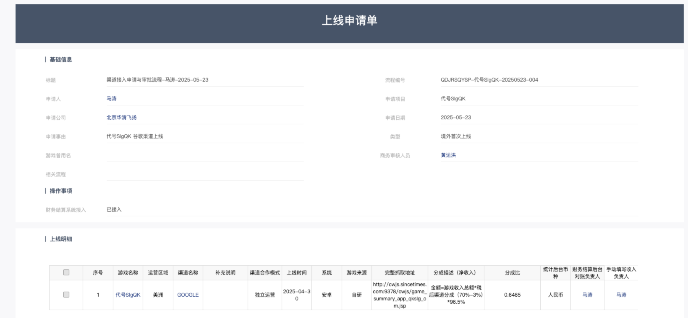
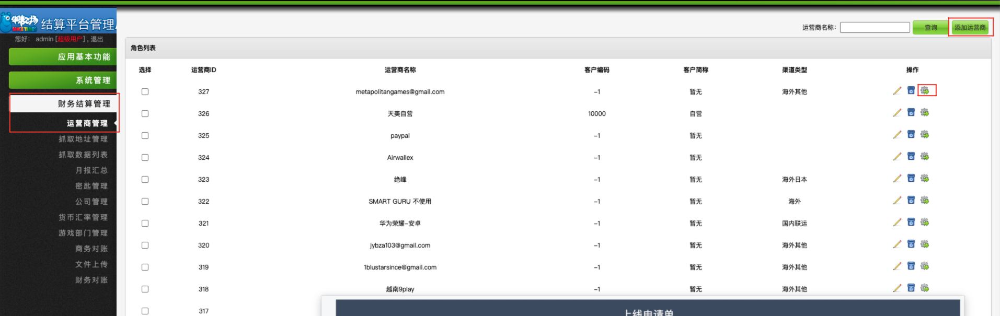
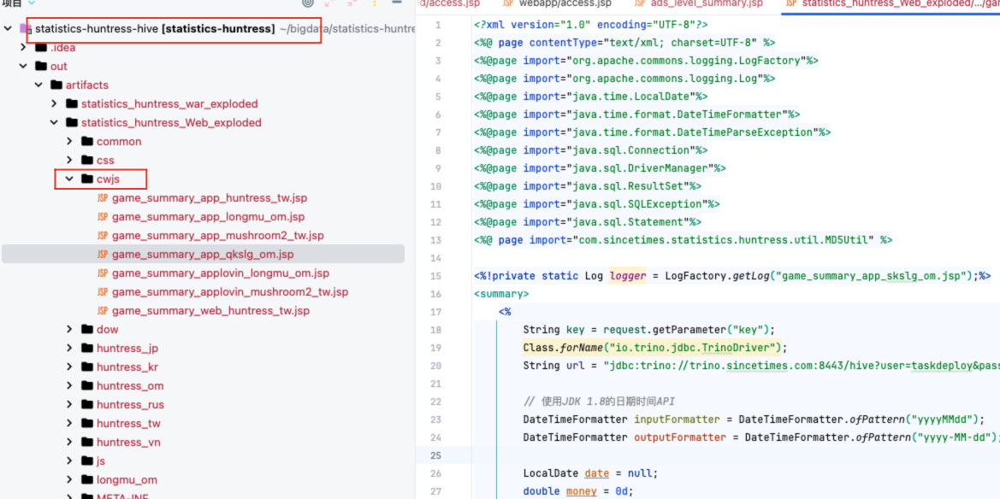
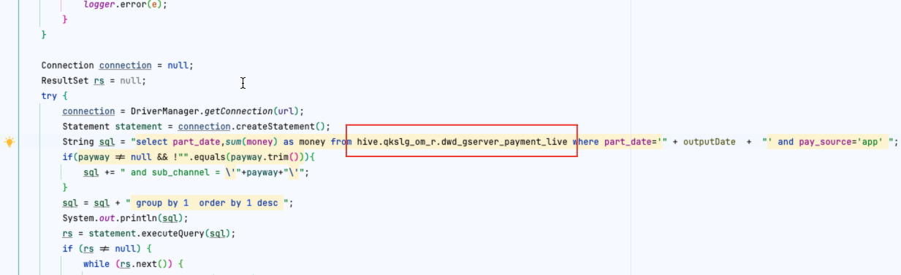
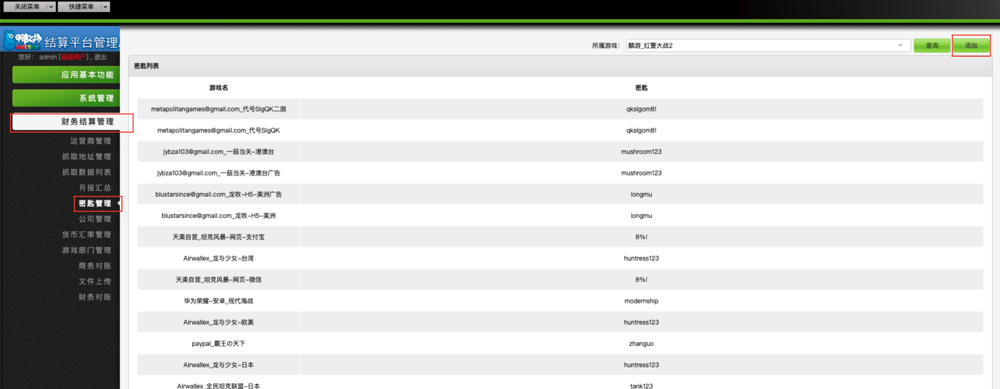
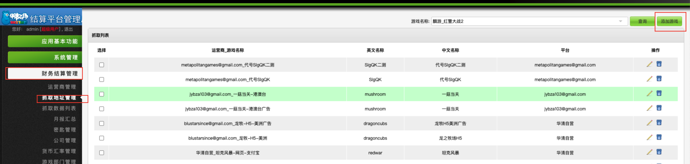
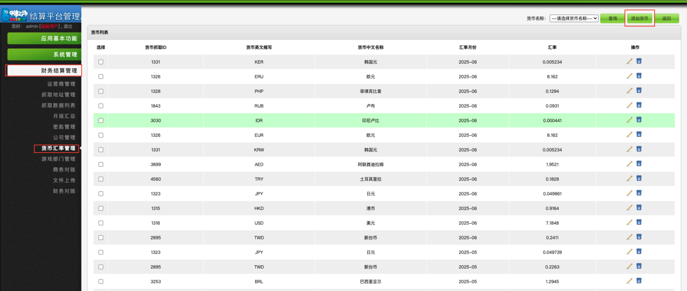

## 1. 项目组提交上线申请单


## 2. 财务系统添加对应的运营商
填写对应的信息


## 3. 添加游戏拉取支付的API接口

修改库名


上传JSP文件到统计2.0服务器

```
# IP
106.52.114.81

# 文件夹
/data/web/statisitcs_huntress_euam/ROOT/cwjs/

# 本地文件夹
/Users/yangdegui/bigdata/statistics-huntress-hive/src/main/webapp/cwjs/
```

## 4. 财务系统添加秘钥

> 秘钥和代码的保持一致

## 5. 财务系统添加抓取地址



# 具体设计工作

## 每月1号, 15号

11.35 会收到邮件.  平均汇率获取成功,  没收到邮件需要自己check

13.09 开始生成月报
15.30 生成月报结束

## 每月月底自己同步下月汇率

https://srh.bankofchina.com/search/whpj/search_cn.jsp



按已有的货币查询更新
货币抓取ID需要和之前的一致

```
KER 和 KRW 都是韩元
ERU 和 EUR 都是欧元
都需要加
```