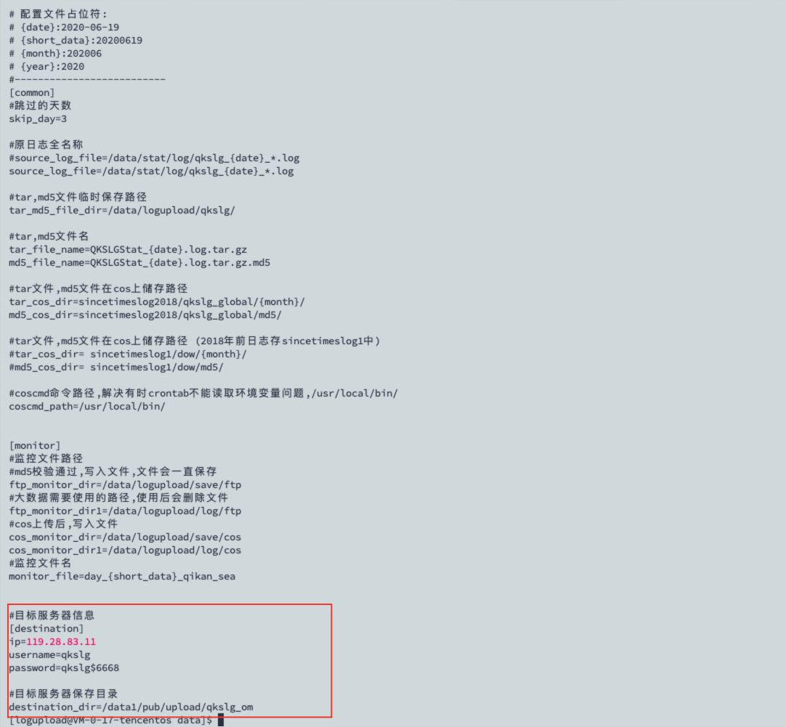
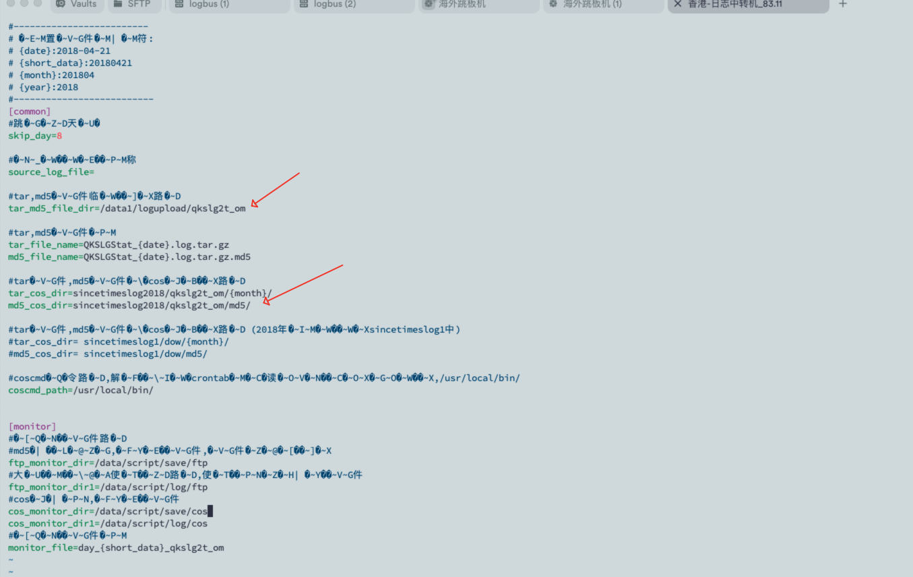
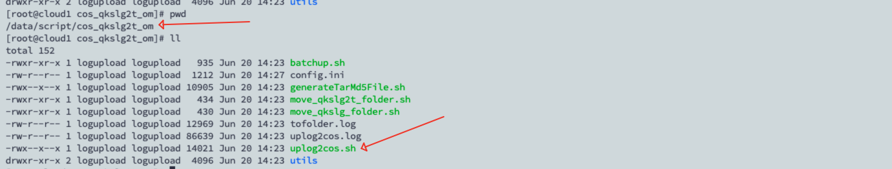

# 1. 项目组游戏日志接受程序
[text](习多-游戏日志接收程序/部署.md)

# 2. T+1日志回传
- 海外回传到香港服务器
- 国内回传到广东服务器

包含
- 游戏日志

登录日志服务器
1. 将uplog2othermachine.sh复制到/data/logupload目录
2. 创建账号 logupload 账号, 并将/data/logupload目录权限设置为logupload账号
```bash
mkdir /data/logupload
useradd -m -d /home/logupload  -c "logupload" -U logupload
chown logupload:logupload /data/logupload
passwd logupload
Hqfy@2025
cp -rf /opt/solf/logupload/* /data/logupload
chown logupload:logupload /data/logupload/*
chmod +x /data/logupload/uplog2othermachine.sh
chmod +x /data/logupload/batchupcos.sh
chmod +x /data/logupload/generateTarMd5File.sh
chmod +x /data/logupload/uplog2cos.sh


```

3. 日志接收机器设置对应的账号权限以及目录

```bash
mkdir /data1/pub/upload/qkslg2t_om
chown root:scponly /data1/pub/upload/qkslg2t_om
sudo chmod 770 /data1/pub/upload/qkslg2t_om
sudo useradd -m -d /home/qkslg -s "/usr/local/bin/scponly" -c "qkslg" -G scponly qkslg
chmod 500 /home/qkslg
passwd qkslg
qkslg$6668
```

4. 编辑 /data/logupload/config.ini 设置目标机器账号以及接受目录


5. 测试是否能传输数据

```bash
/data/logupload/uplog2othermachine.sh /data/logupload/qkslg2t_config.ini 1
```
到接受机器看是否接受完成

6. 配置crontab

```
5 0 * * *  /data/logupload/uplog2othermachine.sh /data/logupload/qkslg2t_config.ini 1 >> /data/logupload/uplog2othermachine_qkslg2t.log 2>&1 &  
```


- 支付日志

# 3. Adjust数据回传部署
[text](习多-Adjust回传日志部署/Adjust回传1.md)

# 4. AdjustCost report部署
[text](习多-AdjustCost回传/AdjustCost回传.md)

# 5. 日志上传腾讯云COS
- 游戏日志


- 支付日志
- Adjust日志
- AdjustCost日志
[text](习多-日志备份流程/游戏日志和AdCost上传COS.md)

# 6. 数数项目创建以及开箱封箱


# 6. 配置Logbus并启用
- Adjust Logbus
- Game Logbus
- 支付 Logbus
- AdjustCost Logbus


# 7. 配置用户广告属性回溯脚本

# 8. 配置广告花费分摊脚本

# 9. 统计部署

# 10. 财务结算部署
[text](习多-财务系统/新增项目操作手册.md)