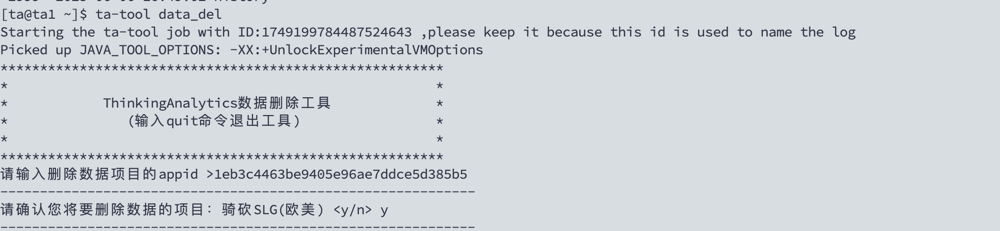
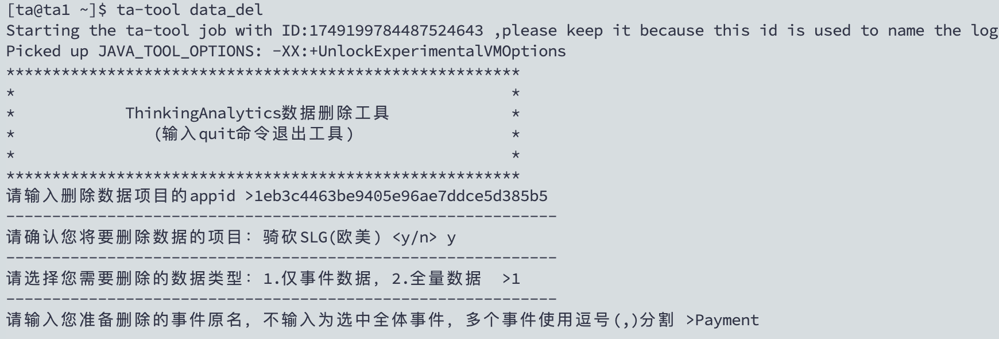
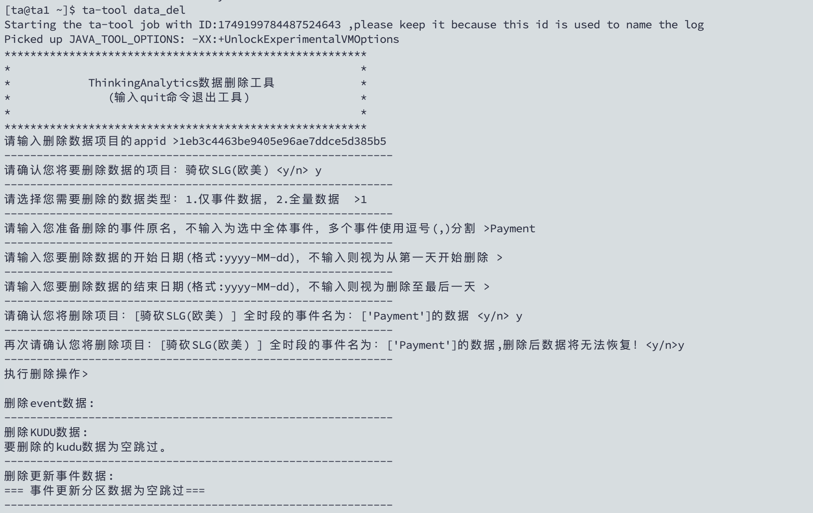

# 数数删除事件数据

## 1. 登录数数服务器

## 2. 切换账号ta

```bash
su - ta
```

## 3. 运行删除命令

```bash
ta-tool data_del
```

## 4. 输入app_id, 数数平台获取



## 5. 选择删除的类型
1. 仅事件数据
- 删除其中几个事件属性

2. 全量数据
    - 删除所有事件, 以及用户信息
## 6. 选择删除的时间



## 7. SQL检查是否删除成功

```sql
SELECT "#user_id" FROM v_event_99 WHERE "$part_event"='Payment' AND "$part_date" is not null LIMIT 10
```