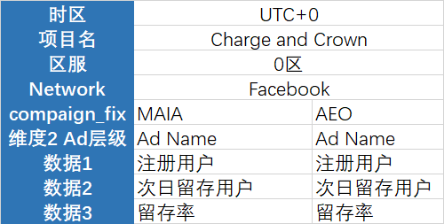

# 需求



# sql

```sql
with info as (
    select
        role_id,
        install_date,
        case
            when upper(campaign) like '%MAIA%' then 'MAIA'
            when upper(campaign) like '%AEO%' then 'AEO'
            else 'OTHER'
        end as campaign_name,
        creative,
        money_ac
    from
        hive.qkslg_om_w.dws_user_info_di
    where
        (
            install_date between date ('2025-04-27')
            and date ('2025-06-01')
        )
        and network = 'Facebook'
),
derive as (
    select
        info.*,
        a.role_id as a_role_id
    from
        info
        left join hive.qkslg_om_w.dws_user_daily_derive_di a on date_diff('day', info.install_date, date(a.part_date)) = 1
        and a.role_id = info.role_id
)
select
    install_date,
    campaign_name,
    creative,
    count(role_id) as "安装人数",
    count(a_role_id) as "次留人数",
    count(a_role_id) * 1.000 / count(role_id) as "留存率",
    sum(money_ac) as "安装用户累充($)"
from
    derive
group by
    1,
    2,
    3
order by
    1,
    2,
    3;

select
    sum(money_rmb)
from
    hive.qkslg_om_r.dwd_gserver_payment_live

```

